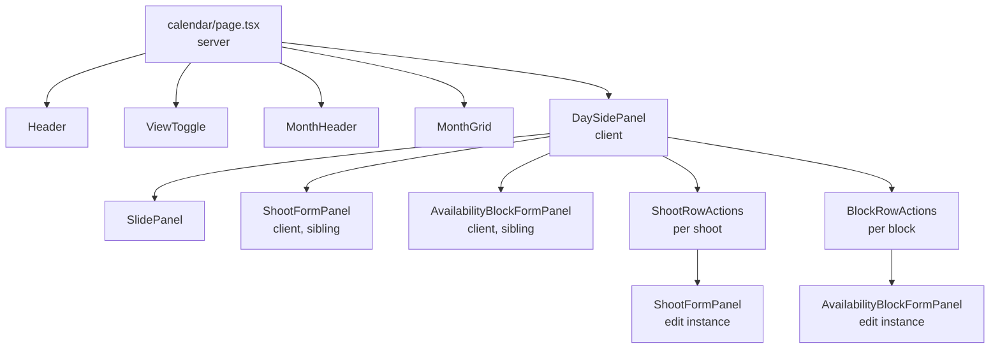

# Scheduling

## 1. Overview

"Scheduling" in this codebase covers three intertwined features built on the owner side: **Shoots** (the things on the calendar), the **Calendar** itself (month grid + day side panel), and **Availability Blocks** (one-off and recurring time blocks Kelsey marks as unavailable). All three share data, navigation, and form patterns, which is why they live in one document.

Today this is owner-only. The client portal still routes `/client/book` to a placeholder. Intentionally out of scope right now: week view rendering (the toggle UI exists, the route doesn't), client-facing booking flow, drag-to-reschedule, recurring shoots, and any third-party calendar sync.

Architecturally: **server components for pages**, **server actions for writes**, **URL search params for navigation state** (no client-side routing layer for "which day is selected"), and **hand-rolled date math** in `app/owner/calendar/_lib/dateMath.ts` (no `date-fns`, no `luxon`).

## 2. Data Model

### `shoots`

Defined in `supabase/schema.sql:55-65`.

| Column | Type | Nullable | Default | Notes |
|---|---|---|---|---|
| `id` | `uuid` | no | `gen_random_uuid()` | PK |
| `client_id` | `uuid` | no | — | FK → `clients(id)` `ON DELETE CASCADE` |
| `project_id` | `uuid` | yes | — | FK → `projects(id)` `ON DELETE SET NULL` |
| `scheduled_at` | `timestamptz` | no | — | UTC under the hood |
| `location` | `text` | yes | — | |
| `duration_hours` | `numeric` | yes | — | |
| `status` | `text` | no | `'requested'` | CHECK constraint: `requested`, `confirmed`, `completed`, `cancelled` |
| `notes` | `text` | yes | — | |
| `created_at` | `timestamptz` | no | `now()` | |

Indexes: `shoots_client_id_idx (client_id)`, `shoots_scheduled_at_idx (scheduled_at)`.

**Status lifecycle:**

- `requested` — Client asked, owner hasn't approved. Placeholder for the eventual client booking flow. **No UI currently creates this state.** The owner-side "Add Shoot" defaults to `confirmed`.
- `confirmed` — On the calendar, scheduled to happen. The default state for owner-created shoots.
- `completed` — Done. Archival — appears in the Past list, no further transitions.
- `cancelled` — Terminated. Retained for history (we don't soft-delete, but `cancelled` serves the same purpose).

Cascade behavior: deleting a `client` deletes their shoots. Deleting a `project` nulls the `project_id` on its shoots.

### `availability_blocks`

Defined in `supabase/schema.sql:154-181`. Schema was extended (column nullability + new column + new constraints) via the alignment block at `schema.sql:195-225`.

| Column | Type | Nullable | Default | Notes |
|---|---|---|---|---|
| `id` | `uuid` | no | `gen_random_uuid()` | PK |
| `date` | `date` | yes | — | Set for one-off; null for recurring |
| `recurring_weekday` | `smallint` | yes | — | 0=Sunday … 6=Saturday; set for recurring; null for one-off |
| `start_time` | `time` | yes | — | Set for time-range; null for all-day |
| `end_time` | `time` | yes | — | Set for time-range; null for all-day |
| `is_blocked` | `boolean` | no | `true` | All current UI sets this true |
| `label` | `text` | yes | — | Owner-only; clients see "Unavailable" without label |
| `created_at` | `timestamptz` | no | `now()` | |

Indexes: `availability_blocks_date_idx (date)`. No index on `recurring_weekday` — recurring rows are full-scanned (small N).

**Two structural axes** enforced via CHECK constraints:

- **One-off vs. recurring** — exactly one of `date` or `recurring_weekday` is set. Mutually exclusive.
- **All-day vs. time-ranged** — both times null = all-day; both times set with `end > start` = ranged. Mixed states rejected.

**Three named CHECK constraints:**

| Constraint | Enforces |
|---|---|
| `availability_blocks_weekday_range` | `recurring_weekday` is null or in `[0, 6]` |
| `availability_blocks_date_or_recurring` | exactly one of `date` / `recurring_weekday` is set |
| `availability_blocks_times_consistent` | both times null, OR both set with `end > start` |

The "can't convert one-off ↔ recurring via update" rule is structurally enforced two ways: the `UpdateBlockInput` server-action type doesn't expose `date`/`recurringWeekday`, and the DB constraint would reject a partial mutation that violates the invariants anyway.

## 3. Architectural Conventions

### Server actions vs. queries

Two strict conventions, not enforced by tooling but holding cleanly across all four `_actions.ts` files (`clients`, `shoots`, `calendar`) and three `queries.ts` files:

- **Server actions** (`_actions.ts`) — always start with `"use server"`. Always return `ActionResult<T> = { ok: true; data: T } | { ok: false; error: string }`. **Never** throw to the caller. Errors from Supabase are caught and translated into the `ok: false` branch; client-side form code uses a `try/catch` only as a defensive backstop for genuinely unexpected exceptions.

- **Query functions** (`_lib/queries.ts`) — always run server-side. **Always** throw on Supabase errors via `throw new Error(error.message)`. Callers are server components; thrown errors hit React error boundaries.

The boundary makes the call sites readable: `await action()` is a discriminated union you destructure; `await query()` either returns data or unwinds the request. Don't blur this.

### Authentication on writes

Every server action calls a local `ensureOwner()` helper at the very top:

```ts
const guard = await ensureOwner();
if (!guard.ok) return { ok: false, error: guard.error };
```

It checks Clerk `auth()` for a session, then `currentUser()` for `publicMetadata.role === "owner"`. The helper currently lives in three files (`clients/_actions.ts`, `shoots/_actions.ts`, `calendar/_actions.ts`) with two slightly different return shapes — see Known Gaps.

### Revalidation pattern

After every successful write, the action calls `revalidatePath()` for any path that displays the affected data:

- **Shoots actions** — always revalidate `/owner/shoots`, `/owner/calendar`, and `/owner/clients/${clientId}`. The client-detail revalidation matters because the `Overview` tab's "Next Shoot" widget reads from `shoots`.
- **Availability block actions** — always revalidate `/owner/calendar`. The recurring page (`/owner/calendar/recurring`) is a static route and gets implicitly refreshed by `force-dynamic`, so we don't separately revalidate it.

`updateShoot` looks up the shoot's `client_id` from the returned row to revalidate the client page; `deleteShoot` looks it up *before* the delete (since the row is gone after).

### Navigation state via URL

The calendar uses search params, not client state, for everything navigational:

- `?month=YYYY-MM` — which month is being viewed
- `?date=YYYY-MM-DD` — which day's side panel is open

Tradeoff: every navigation is a fresh server render (and a fresh DB read of the visible month range). In exchange, the state is bookmarkable, shareable, back-button-friendly, and the page can stay a server component. The `DaySidePanel` opens iff `date` is set; clicking the panel close button (X) `router.push`es to `/owner/calendar?month=...` (no `date`).

### Timezone strategy

All timestamps stored as `timestamptz` (UTC). Display and form pre-fill rely on the browser's local timezone — there's no user setting and no server-side locale handling.

| Direction | Code | Where |
|---|---|---|
| Display | `new Date(iso).toLocaleString(...)` | `formatDateTime`, `formatTimeOnly` |
| Form pre-fill (UTC ISO → `<input type=datetime-local>`) | `isoToLocalDateTime(iso)` | `ShootFormPanel.tsx:56` |
| Form submit (local datetime-local → UTC ISO) | `new Date(localValue).toISOString()` | `ShootFormPanel.tsx`, `defaultShootIsoForDay()` |

Round-trip verified: a shoot created at 2:30 PM local renders as 2:30 PM after reload, regardless of the server's timezone.

## 4. Server Data Layer (Code Reference)

### `app/owner/shoots/_lib/queries.ts`

| Function | Description | Consumers |
|---|---|---|
| `fetchUpcomingShoots(limit?) → ShootWithClientName[]` | `scheduled_at >= now`, status in `requested`/`confirmed`, ascending | `app/owner/shoots/page.tsx` |
| `fetchPastShoots(limit?) → ShootWithClientName[]` | `scheduled_at < now` OR status in `completed`/`cancelled`, descending | `app/owner/shoots/page.tsx` |
| `fetchShootsInRange(start, end) → ShootWithClientName[]` | All shoots in `[start, end)`, ascending | `app/owner/calendar/page.tsx` |

`ShootWithClientName = ShootRecord & { client_name: string }`. Client names attached via a private `attachClientNames` helper that issues one batched `clients.select("id,name").in("id", clientIds)` per call — avoids N+1.

### `app/owner/shoots/_actions.ts`

All return `Promise<ActionResult<T>>`. All revalidate `/owner/shoots`, `/owner/calendar`, and `/owner/clients/${clientId}` on success.

| Action | Description | Notes |
|---|---|---|
| `createShoot(input) → ShootRecord` | Insert. Validates `clientId`, `scheduledAt`. Defaults `status` to `confirmed`. | |
| `updateShoot(shootId, updates) → ShootRecord` | Sparse patch — only fields explicitly present in `updates` are applied. | Won't accidentally null untouched columns. |
| `confirmShoot(shootId) → ShootRecord` | `updateShoot(id, { status: 'confirmed' })` wrapper. | |
| `cancelShoot(shootId) → ShootRecord` | `updateShoot(id, { status: 'cancelled' })` wrapper. | |
| `completeShoot(shootId) → ShootRecord` | `updateShoot(id, { status: 'completed' })` wrapper. | |
| `deleteShoot(shootId) → null` | Hard delete. Looks up `client_id` first to revalidate the client page. | |

Status validation accepts the four values; allowed transitions are not server-enforced — the UI hides invalid transitions in `ShootRowActions` instead.

### `app/owner/calendar/_lib/queries.ts`

| Function | Description | Consumers |
|---|---|---|
| `fetchAvailabilityBlocksInRange(start, end) → AvailabilityBlockRecord[]` | Two parallel queries: one-offs in `[start, end)` and **all** recurring blocks (regardless of range). Merged. | `app/owner/calendar/page.tsx` |
| `fetchRecurringAvailabilityBlocks() → AvailabilityBlockRecord[]` | All rows where `recurring_weekday IS NOT NULL`. Doesn't filter on `is_blocked`. | `app/owner/calendar/recurring/page.tsx` |
| `blocksForDate(blocks, date) → AvailabilityBlockRecord[]` | Pure: filters a fetched array down to blocks applying to a specific date (one-off match by `date`, recurring by `getDay()`). | `MonthGrid`, `DaySidePanel` |

### `app/owner/calendar/_lib/dateMath.ts`

Pure functions, no DB. Grouped:

**Parsing & formatting (URL params and display):**

| Function | Description |
|---|---|
| `parseMonthParam(s) → YearMonth` | `"YYYY-MM"` → `{year, month}`. Falls back to current month on parse failure. |
| `formatMonthParam(ym) → string` | `{year, month}` → `"YYYY-MM"`. |
| `monthLabel(ym) → string` | `"May 2026"`. |
| `parseDateParam(s) → Date \| null` | `"YYYY-MM-DD"` → local Date at midnight, or `null` on failure. |
| `dateKey(d) → string` | Local `"YYYY-MM-DD"` for grouping shoots/blocks by day. |
| `friendlyDate(d) → string` | `"Friday, May 15, 2026"` for the side panel header. |
| `formatTimeOnly(d) → string` | `"9:00 AM"` via `toLocaleTimeString`. |
| `formatTimeRange(start, end) → string` | `"8:00 AM – 5:00 PM"` or `"All day"` when both null. |
| `weekdayLabel(n) → string` | `0` → `"Sunday"`, etc. |

**Grid math:**

| Function | Description |
|---|---|
| `currentYearMonth() → YearMonth` | `{year, month}` for now. |
| `addMonths(ym, delta) → YearMonth` | Handles year rollover via `Math.floor` + modulo. |
| `getMonthGrid(ym) → Date[]` | **Always 42 dates** (6×7), starting on the Sunday of the week containing the 1st. Leans on JS `Date`'s month rollover for prev/next-month days. |
| `gridRange(ym) → {start, end}` | First and last+1 of the 42-day grid as Dates. End is exclusive. |
| `inMonth(d, ym) → boolean` | Does this date belong to that month/year. |
| `isToday(d, now?) → boolean` | Day-level equality, ignoring time. |
| `isSameDay(a, b) → boolean` | Internal helper, exported (only consumer is `isToday`). |

**Pre-fill helper:**

| Function | Description |
|---|---|
| `defaultShootIsoForDay(d) → string` | UTC ISO at 9:00 AM local on `d`. Used by `DaySidePanel` to seed `ShootFormPanel.defaultScheduledAt`. |

### `app/owner/calendar/_actions.ts`

All return `Promise<ActionResult<T>>`. All revalidate `/owner/calendar` on success. None revalidate the recurring page (it's `force-dynamic`).

| Action | Description | Notes |
|---|---|---|
| `createAvailabilityBlock(input) → AvailabilityBlockRecord` | Validates "exactly one of `date`/`recurringWeekday`" + time consistency before insert. | |
| `updateAvailabilityBlock(blockId, updates) → AvailabilityBlockRecord` | Sparse patch. Only `startTime`/`endTime`/`label` mutable — type doesn't expose `date`/`recurringWeekday`. | "Don't allow conversion" rule enforced via input type. |
| `deleteAvailabilityBlock(blockId) → null` | Hard delete. | |

A private `validateTimes(startTime, endTime)` helper is shared between create and update: rejects mixed null/set, requires `end > start` when both are set, returns canonical `{ start, end }` (both null for all-day, both string for time-range).

## 5. UI Surface Map

### Shoots

| File | Type | What it does |
|---|---|---|
| `app/owner/shoots/page.tsx` | Server | Fetches `fetchUpcomingShoots()`, `fetchPastShoots()`, `fetchClientsWithRelations()` in parallel. Renders `<AddShootButton>`, two `<ShootSection>` (Upcoming + Past). `force-dynamic`. |
| `app/owner/shoots/_components/AddShootButton.tsx` | Client | Button + state for the create modal. Renders `<ShootFormPanel>` with no `shoot` prop. |
| `app/owner/shoots/_components/ShootFormPanel.tsx` | Client | Universal create/edit form. `shoot` prop wins over `defaultScheduledAt`. Submits via `createShoot`/`updateShoot`. Handles the UTC↔local datetime round-trip. |
| `app/owner/shoots/_components/ShootRowActions.tsx` | Client | `···` dropdown per row. Items conditional on `shoot.status` — `requested` shows Confirm/Cancel; `confirmed` shows Mark Complete/Cancel; `completed`/`cancelled` show only Edit/Delete. Click-outside + Escape close the menu. |

### Calendar

| File | Type | What it does |
|---|---|---|
| `app/owner/calendar/page.tsx` | Server | Reads `?month`, `?date` from search params (Next 15 async API). Fetches shoots, blocks, clients in parallel for the 42-day grid range. Renders header (with "Recurring Hours" link + `<ViewToggle>`), `<MonthHeader>`, `<MonthGrid>`, `<DaySidePanel>`. `force-dynamic`. |
| `app/owner/calendar/_components/ViewToggle.tsx` | Server | Segmented Month (active) / Week (disabled, `title="Coming soon"`). No interactivity — static buttons. |
| `app/owner/calendar/_components/MonthHeader.tsx` | Server | ◀ / ▶ / Today as `<Link>`s, plus the month label. All navigation via URL — no client state. |
| `app/owner/calendar/_components/MonthGrid.tsx` | Server | 7×6 CSS grid. Each cell is a `<Link>` to `?month=…&date=…`. Per cell: filters via `blocksForDate`, splits into all-day vs. time-range, applies tint or 3-px top bar. Today gets a 2px mauve outline. |
| `app/owner/calendar/_components/DaySidePanel.tsx` | Client | Wraps `SlidePanel`. Stacked "+ Add Shoot" / "+ Block Time" buttons. Two sections (Shoots, Availability Blocks). Renders `<ShootFormPanel>` and `<AvailabilityBlockFormPanel>` as siblings — both can stack atop the day panel. Close button `router.push`es to `?month=...` (no date). |
| `app/owner/calendar/_components/AvailabilityBlockFormPanel.tsx` | Client | Universal create/edit. `block` prop wins over `date`/`recurringWeekday`. Date or "Every Monday" rendered as a read-only field. All-day toggle hides/shows time inputs. |
| `app/owner/calendar/_components/BlockRowActions.tsx` | Client | `···` dropdown. `canEdit` prop controls whether Edit appears (recurring blocks in `DaySidePanel` get only Delete; the recurring page passes `canEdit={true}`). |

### Recurring availability

| File | Type | What it does |
|---|---|---|
| `app/owner/calendar/recurring/page.tsx` | Server | Calls `fetchRecurringAvailabilityBlocks()`, groups by weekday, sorts each column (all-day first, then by `start_time`). Renders 7 `<RecurringColumn>`s and a "← Back to Calendar" link. `force-dynamic`. |
| `app/owner/calendar/recurring/_components/RecurringColumn.tsx` | Client | One weekday column. Holds local `addOpen` state. Renders block list (with `BlockRowActions canEdit`) + a ghost-style "+ Add Block" button. Add opens `<AvailabilityBlockFormPanel recurringWeekday={weekday}>`. |

### Calendar page component tree



## 6. Key Implementation Decisions

### `ActionResult<T>` vs throwing (and why queries are different)

- **Decision:** Server actions return a discriminated union; queries throw.
- **Alternative considered:** Throw from both, surface via React error boundary.
- **Why:** Form submission needs inline error display ("End time must be after start time") on the field, not a full-page error boundary. Queries serve full-page renders where a thrown error is the right escalation. Two channels, two consumer shapes.

### Hand-rolled date math instead of `date-fns`

- **Decision:** All date arithmetic in `dateMath.ts`, no library.
- **Alternative considered:** Add `date-fns` for `addMonths`, `startOfWeek`, `format`.
- **Why:** The total surface area we needed (~15 functions, all in one file) was small enough that a dep wasn't worth the install footprint or the lock-in. Native JS `Date` handles the month-rollover case (`new Date(2026, 11, 32)` → Jan 1 2027) cleanly enough for grid math. If we ever need recurring rules beyond simple weekday-of-week, revisit.

### Whole calendar cell as a `<Link>` instead of individual clickable pills

- **Decision:** The entire `<td>`-equivalent is one `<Link>`. Shoot pills inside are display-only.
- **Alternative considered:** Pills as individual links to a shoot detail page; cell click as fallback.
- **Why:** Nesting `<a>`s is invalid markup. Splitting click targets within a small cell is a fiddly UX. The day side panel already lists every shoot for the day with full actions, so the pill doesn't need its own destination.

### Month grid always renders 6 rows regardless of month

- **Decision:** Always 42 cells.
- **Alternative considered:** 4–6 rows depending on whether the month "fits."
- **Why:** Stable grid height across months. No layout jump when navigating month-to-month. Cells from adjacent months render in muted gray and are still clickable (they navigate to that month + open the day panel).

### URL search params for calendar navigation

- **Decision:** `?month=YYYY-MM&date=YYYY-MM-DD`.
- **Alternative considered:** Client-side `useState` for selected month/day with no URL mirroring.
- **Why:** Bookmarkable, shareable, browser-back works, and the page stays a server component (which keeps fresh DB data per render). The cost is a network round-trip per navigation, which is acceptable for a single-user owner tool.

### One table for both one-off and recurring availability blocks

- **Decision:** Single `availability_blocks` table with `date` XOR `recurring_weekday` enforced via CHECK.
- **Alternative considered:** Two tables (`availability_one_off`, `availability_recurring`).
- **Why:** Reads always need both kinds together (anything looking at "blocks for May" needs to expand recurring rules). Two tables would mean a UNION at every read site or an extra abstraction. The CHECK constraints make the discriminator self-documenting and impossible to violate.

### No `--accent-tint-soft` / `--accent-tint-strong` CSS tokens

- **Decision:** `MonthGrid.tsx` uses raw `rgba(168, 120, 138, 0.16)` and `rgba(168, 120, 138, 0.06)` for the selected and all-day-blocked tints.
- **Alternative considered:** Add the two tokens to `globals.css`.
- **Why (shortcut, not principled):** CSS custom properties don't interpolate into `rgba()` without `color-mix()` (modern browsers only) or a preprocessor. The two tints are isolated to one file. Worth promoting to tokens eventually; not blocking.

### `StatusPill` tones reused for shoot status

- **Decision:** Map `requested → neutral`, `confirmed → accent`, `completed → success`, `cancelled → danger` directly to the existing `StatusPill` tone palette.
- **Alternative considered:** New shoot-specific tone tokens.
- **Why:** The four colors needed already existed and meant the right things. Inventing new tokens would have been pure naming.

### Sequential `ALTER`s in the alignment block instead of `CREATE TYPE` enums

- **Decision:** Status fields are `text` columns with CHECK constraints, not Postgres enums.
- **Alternative considered:** `CREATE TYPE shoot_status AS ENUM (...)`.
- **Why:** Enums in Postgres are painful to evolve — adding a value requires `ALTER TYPE ... ADD VALUE`, removing one is essentially "drop and recreate the column." `text` + CHECK is cheaper to migrate, idempotent in our alignment pattern, and the type safety we care about is in TypeScript anyway.

## 7. Known Gaps / Followups

### Worth fixing soon

- **`ensureOwner` consolidation.** Three local copies across `clients/_actions.ts`, `shoots/_actions.ts`, `calendar/_actions.ts`. Two slightly different shapes (clients returns `ownerLabel`, the others don't). Extract to `lib/auth.ts`.
- **`fetchClientNames` helper.** `shoots/page.tsx` calls `fetchClientsWithRelations()` purely to feed `[{id, name}]` into the modal dropdown — drags in projects/packages/time_logs joins that are immediately discarded.
- **Week view.** `ViewToggle` shows a disabled Week button. Either build the route or remove the toggle.

### Deferred (no urgency)

- **Dropdown menu clipping.** `ShootRowActions` and `BlockRowActions` use `position: absolute` for the menu. Bottom rows of the shoots Past table and scrolled-down items inside `DaySidePanel`'s `overflow-y: auto` get clipped. Fix is upward-opening menus near the bottom or `position: fixed` with computed coords.
- **Error-handling inconsistency.** `TimeTab.tsx` swallows action errors silently; `ShootRowActions` and `BlockRowActions` surface via `alert()`. Pick one.
- **3-deep `SlidePanel` stacking.** `DaySidePanel` → `ShootFormPanel` + `AvailabilityBlockFormPanel` can all be open at z-index 50 simultaneously. Visual layering depends on DOM render order. Rare in practice.
- **Hardcoded `rgba` values.** Two instances in `MonthGrid.tsx:115,117`. See decision above.
- **Hardcoded `#FFFFFF`.** Used for text-on-accent in `ViewToggle.tsx:26` and `components/ui/Button.tsx:14`. No `--text-on-accent` token in the repo.
- **`force-dynamic` on `/owner/calendar/recurring`.** ISR with on-demand revalidation would be cheaper. Rounding-error cost at current scale.
- **Dropdown menus lack arrow-key navigation.** Click-only. Acceptable for an owner-only internal tool.
- **`isSameDay` exported but only used internally** by `isToday`. Cosmetic.

### Not yet built

- **Client-side Shoots/Calendar UI.** `/client/book` is a placeholder. No client-facing shoot list, no booking flow, no availability visibility.
- **Visual indicator on cells for clients showing "unavailable" without leaking labels.** When the client view exists, blocks render as tints/badges with no `label` exposed.

## 8. Testing Notes

Edge cases worth re-checking on every change to scheduling code. None of these are covered by automated tests today.

- **Timezone round-trip.** Create a shoot at 2:30 PM local → reload → `formatDateTime` should still show "2:30 PM". The most common bug is a UTC-vs-local off-by-one that only surfaces in non-UTC timezones.
- **Month-boundary edge cases.** Verify the 42-cell invariant holds for:
  - **March 2026** — 1st is a Sunday, no leading prev-month days.
  - **August 2026** — 1st is a Saturday, six leading prev-month days.
  - **February 2026** — 28 days, 1st is a Sunday. Should still render 6 rows (with 14 trailing March days), not collapse to 4.
- **Recurring block tinting.** Create an "every Monday" all-day recurring block. Open May 2026 — Mondays 4, 11, 18, 25 should all show the 6% mauve tint. Any prev/next-month Mondays visible at the grid edges (Apr 27, Jun 1) should also be tinted.
- **Status transition flow.** Create a shoot in `requested` → menu shows Edit, Confirm, Cancel, Delete. Confirm it → menu changes to Edit, Mark Complete, Cancel, Delete. Mark Complete → menu becomes Edit, Delete only. Delete → row gone.
- **Stacked side panels.** Open a day → "+ Add Shoot" → without closing it, "+ Block Time" → close in reverse order → the day panel should still be functional and not stuck. If the block panel closes the shoot panel beneath it, that's a bug.
- **All-day vs time-range visual precedence.** A cell with **only an all-day block** shows the 6% tint, no top bar. A cell with **only a time-range block** shows the 3px mauve top bar, no tint. A cell with **both** shows only the tint (top bar suppressed). The `selected` state takes precedence over both.
- **Datetime pre-fill from calendar click.** Click an empty cell → "+ Add Shoot" → the datetime field should pre-fill to that day at 09:00 local. Submit → the shoot pill should appear on that exact cell, not the day before/after.

## 9. Schema Migration Reference

- **Source:** `supabase/schema.sql`. One file, two layers.
- **Dual-track pattern:**
  - `CREATE TABLE` blocks at the top define the **fresh-install shape**. A new Supabase project running this file gets the current schema directly.
  - **Alignment block at the bottom** (`schema.sql:166` onwards) brings an **already-deployed instance** up to spec via idempotent `ALTER`s. Re-running the alignment block on a current schema is a no-op.
- **Idempotency primitives used:**
  - `add column if not exists`
  - `alter column ... drop not null` (no-op on already-nullable columns)
  - `drop constraint if exists` followed by `add constraint ...` (PostgreSQL has no `add constraint if not exists`)
- **Verifying a migration applied:** Query `pg_constraint` to confirm the named CHECK constraints exist:

  ```sql
  select conname, pg_get_constraintdef(oid)
  from pg_constraint
  where conrelid = 'availability_blocks'::regclass;
  ```

  Expect `availability_blocks_weekday_range`, `availability_blocks_date_or_recurring`, `availability_blocks_times_consistent` (plus the implicit PK constraint).
- **Don't:** edit the `CREATE TABLE` block without also appending alignment `ALTER`s for the same change. The source-of-truth invariant is "running the whole file front-to-back on either an empty or an existing DB produces the same end state."
